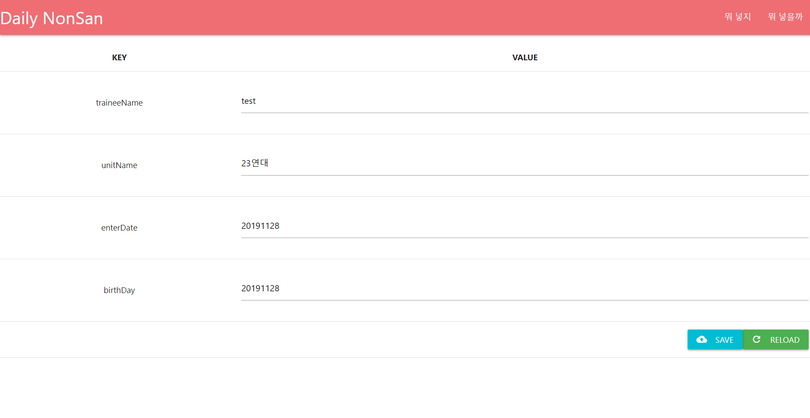
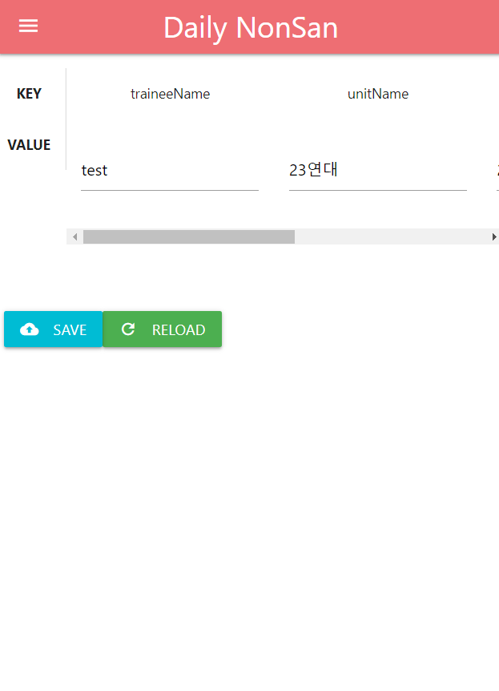

# DailyNonsan
더캠프를 통해 정기적으로 지정한 소식들을 담은 인터넷 편지를 전송해주는 봇

# the-camp-lib
* [이 게시글](https://parksb.github.io/article/34.html)을 구글 검색을 통해 접하게 되었고, 해당 글에 링크로 걸려있는 [이 라이브러리](https://github.com/ParkSB/the-camp-lib)를 이용해 제작했습니다.

# 작업 일시 중지
* 훈련소 들어가는 당일이 되서도 봇으로 뭘 보내는게 좋을지 안 떠올라서 개발 진척이 안 되고 있었습니다.
* 이 프로젝트는 복귀 이후 하는 것으로 하고 지금이라도(입소 12시간 전) 자는 것이 더 도움이 될 듯 합니다...

## 현재 시점에서 구성된 임시 웹 UI

